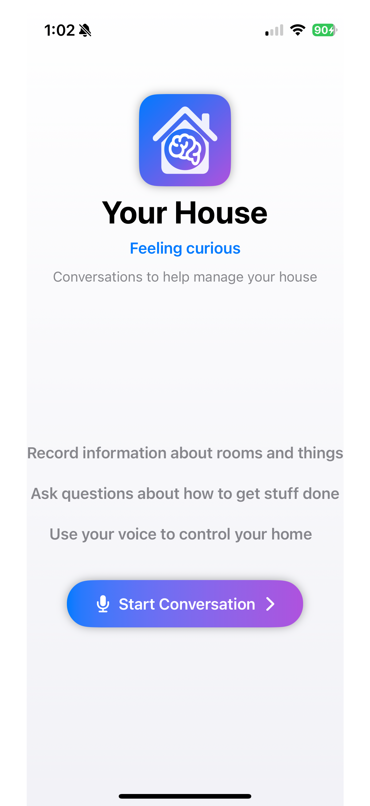
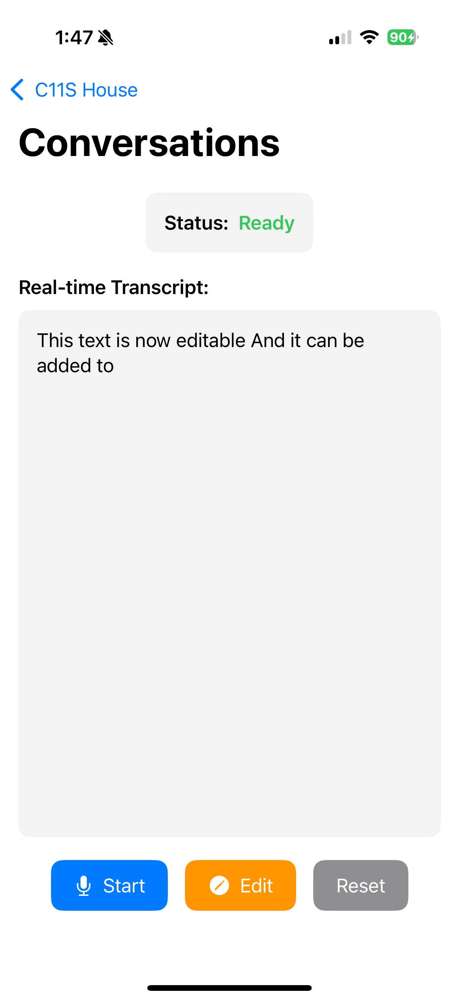
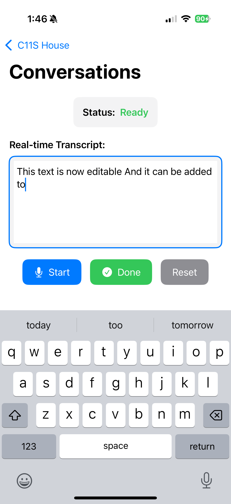

# c11s-house-ios

## An iOS app that provides a voice based interface to the house consciousness system

Using native swift and the latest Apple Intelligence features, support the APIs and functionality of https://github.com/adrianco/consciousness

Plans created here with claude-flow

------
Prompt used was 

$ ./claude-flow swarm "review the README.md in root and create a detailed technical implementation plan in /plans using TDD, don't implement any code yet"

Above this line is all that was provided as input to this development process.

Update after plans were built in 5 minutes and pushed back to the repo.

Log of the output as it did this work is saved in the repo.

## Status

## Screenshots

  
  
  

  <b>Home Screen</b> &nbsp;&nbsp;&nbsp;&nbsp;&nbsp;&nbsp;&nbsp;&nbsp;&nbsp;&nbsp;&nbsp;&nbsp;&nbsp;&nbsp;&nbsp;&nbsp;
  <b>Conversations View</b> &nbsp;&nbsp;&nbsp;&nbsp;&nbsp;&nbsp;&nbsp;&nbsp;&nbsp;&nbsp;&nbsp;&nbsp;&nbsp;&nbsp;&nbsp;&nbsp;
  <b>Edit Mode</b>

### 2025-07-04 Update
Initial app implementation is now functional with core features:
- **App Icon**: Dynamic gradient icon with house and brain symbols using AppIconCreator
- **Main Interface**: Landing screen with house personality (name and emotion placeholders)
- **Voice Conversations**: Real-time speech recognition renamed from FixedSpeech to ConversationView
  - Persistent transcript that survives between recordings
  - Editable transcript with dedicated edit mode
  - Proper handling of incremental speech updates (no more duplication)
  - Append mode for continuous conversation logging
- **Testing**: Physical device testing required for speech recognition functionality (Xcode Cloud not needed at this stage)

Previous status:
- Reviewed with help from someone that knows current Apple development and looks good.
- Working on refining the server and its user flows before we will attempt to build this app.

