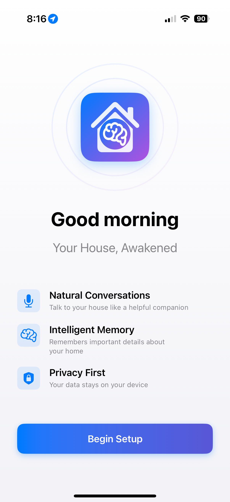
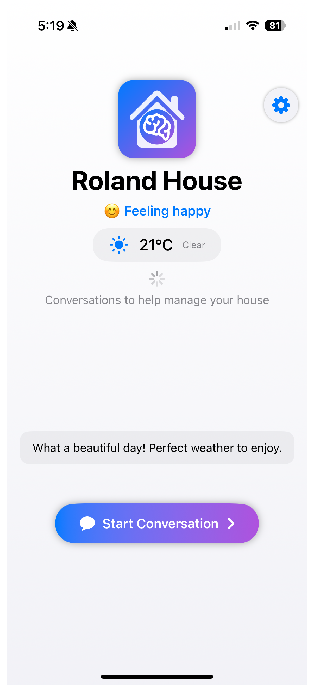
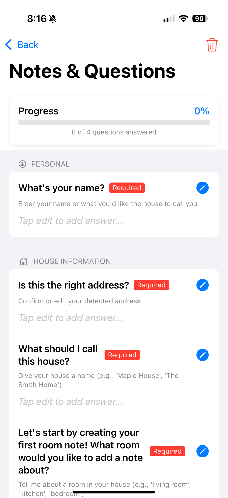
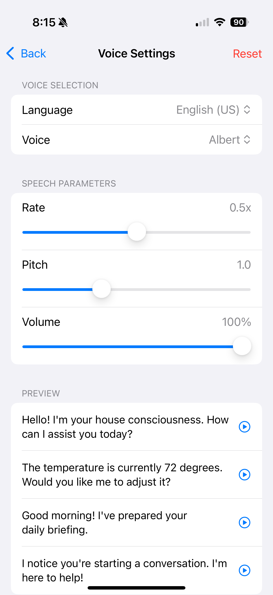

# c11s-house-ios

## An iOS app that provides a voice-based interface to the house consciousness system

C11S House gives your home a conscious, conversational personality. Using native Swift and the latest iOS features, it creates an intelligent companion that learns about your home and helps manage it through natural voice interactions.

## 🏠 Features

### Core Functionality
- **Natural Voice Conversations**: Real-time speech recognition and synthesis for fluid interactions
- **Intelligent Memory System**: Persistent notes about your home, rooms, and devices
- **Weather-Aware Personality**: House emotions respond to current weather conditions
- **Privacy-First Design**: All processing happens on-device, no cloud dependencies

### Technical Highlights
- Built with SwiftUI and modern Swift concurrency (async/await)
- Protocol-oriented architecture with dependency injection
- Comprehensive test coverage (unit and UI tests)
- Thread-safe operations with actor-based concurrency
- Reactive UI using Combine framework

## 📱 Current Status (2025-07-23)

The app is fully functional with:
- ✅ Complete onboarding flow with permission management
- ✅ Voice conversation interface with persistent transcripts
- ✅ Notes system for storing house information
- ✅ Weather integration with location services
- ✅ Customizable voice settings
- ✅ Emotion-aware house personality

### Upcoming Features
- 🔄 HomeKit integration (see [plans/homekit.md](plans/homekit.md))
- 🔄 Apple Intelligence integration for smarter conversations
- 🔄 Multi-room awareness and device control

## Screenshots

<div align="center">
  
  
  
</div>

<div align="center">
  <b>Welcome & Setup</b> &nbsp;&nbsp;&nbsp;&nbsp;&nbsp;&nbsp;&nbsp;&nbsp;&nbsp;&nbsp;&nbsp;&nbsp;&nbsp;&nbsp;&nbsp;&nbsp;
  <b>Home Screen</b> &nbsp;&nbsp;&nbsp;&nbsp;&nbsp;&nbsp;&nbsp;&nbsp;&nbsp;&nbsp;&nbsp;&nbsp;&nbsp;&nbsp;&nbsp;&nbsp;
  <b>Conversation View</b>
</div>

<div align="center">
  
  
</div>

<div align="center">
  <b>Notes & Questions</b> &nbsp;&nbsp;&nbsp;&nbsp;&nbsp;&nbsp;&nbsp;&nbsp;&nbsp;&nbsp;&nbsp;&nbsp;&nbsp;&nbsp;&nbsp;&nbsp;
  <b>Voice Settings</b>
</div>

## 🚀 Getting Started

### Prerequisites
- Xcode 15.0 or later
- iOS 17.0+ deployment target
- Apple Developer account (for device testing with speech recognition)

### Setup
1. Clone the repository
2. Open `C11Shouse/C11SHouse.xcodeproj` in Xcode
3. Update signing & capabilities with your development team
4. Build and run on a physical device (speech recognition requires device)

### First Launch
1. Grant microphone and speech recognition permissions
2. Optionally allow location access for weather features
3. Complete the onboarding flow to personalize your house
4. Start having conversations with your house consciousness!

## 📁 Project Structure

```
c11s-house-ios/
├── C11Shouse/                    # Main Xcode project
│   ├── C11SHouse/               # App source code
│   │   ├── Models/              # Data models and business logic
│   │   ├── Services/            # Service layer (API, persistence)
│   │   ├── ViewModels/          # MVVM view models
│   │   ├── Views/               # SwiftUI views
│   │   └── Infrastructure/     # Core utilities and managers
│   ├── C11SHouseTests/          # Unit tests
│   └── C11SHouseUITests/        # UI tests
├── plans/                       # Documentation and planning
│   ├── current-state/           # Current implementation docs
│   ├── development/             # Development guidelines
│   ├── implementation/          # Feature implementation plans
│   └── user-interface/          # UI/UX design docs
└── CLAUDE.md                    # AI assistant instructions
```

## 🧪 Testing

Run tests via Xcode or command line:
```bash
# Unit tests
xcodebuild test -scheme C11SHouse -destination 'platform=iOS Simulator,name=iPhone 15'

# UI tests (requires simulator or device)
xcodebuild test -scheme C11SHouse -destination 'platform=iOS Simulator,name=iPhone 15' -only-testing:C11SHouseUITests
```

## 📚 Documentation

- [Architecture Overview](plans/current-state/architecture.md)
- [Development Guidelines](plans/development/guidelines.md)
- [Onboarding UX Plan](plans/user-interface/OnboardingUXPlan.md)
- [HomeKit Integration Plan](plans/homekit.md)

## 🤝 Contributing

This project uses AI-assisted development with Claude. See [CLAUDE.md](CLAUDE.md) for AI context and instructions.

## 📄 License

[Add license information]

## 🙏 Acknowledgments

- Built with assistance from [Claude Code](https://claude.ai/code)
- Inspired by the [consciousness](https://github.com/adrianco/consciousness) project


