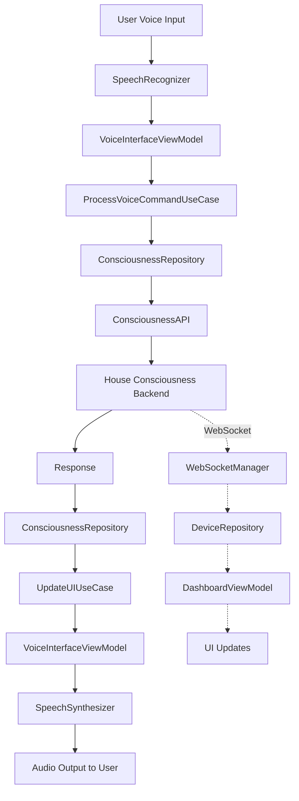

# iOS House Consciousness App Architecture

## Overview

The c11s-house-ios app provides a voice-based interface to interact with a house consciousness system. The architecture follows Clean Architecture principles with MVVM-C (Model-View-ViewModel-Coordinator) pattern to ensure testability, maintainability, and clear separation of concerns.

## Architecture Pattern: Clean Architecture + MVVM-C

### Core Principles
- **Dependency Inversion**: Inner layers don't know about outer layers
- **Testability First**: All business logic is unit testable
- **Protocol-Oriented Design**: Heavy use of protocols for abstraction
- **Reactive Programming**: Combine framework for data flow
- **Coordinator Pattern**: Navigation logic separated from ViewModels

## Module Structure

```
c11s-house-ios/
├── App/
│   ├── AppDelegate.swift
│   ├── SceneDelegate.swift
│   └── AppCoordinator.swift
├── Domain/
│   ├── Entities/
│   │   ├── Conversation.swift
│   │   ├── Device.swift
│   │   ├── HouseContext.swift
│   │   └── VoiceCommand.swift
│   ├── UseCases/
│   │   ├── ProcessVoiceCommandUseCase.swift
│   │   ├── GetHouseStatusUseCase.swift
│   │   ├── UpdateDeviceStateUseCase.swift
│   │   └── LearnDeviceCapabilitiesUseCase.swift
│   └── Repositories/
│       ├── ConsciousnessRepositoryProtocol.swift
│       ├── DeviceRepositoryProtocol.swift
│       └── VoiceRepositoryProtocol.swift
├── Data/
│   ├── Repositories/
│   │   ├── ConsciousnessRepository.swift
│   │   ├── DeviceRepository.swift
│   │   └── VoiceRepository.swift
│   ├── DataSources/
│   │   ├── Remote/
│   │   │   ├── ConsciousnessAPI.swift
│   │   │   └── WebSocketManager.swift
│   │   └── Local/
│   │       ├── CoreDataManager.swift
│   │       └── UserDefaultsManager.swift
│   └── Models/
│       ├── APIModels.swift
│       └── CoreDataModels.xcdatamodeld
├── Presentation/
│   ├── Coordinators/
│   │   ├── MainCoordinator.swift
│   │   ├── VoiceCoordinator.swift
│   │   └── SettingsCoordinator.swift
│   ├── Views/
│   │   ├── VoiceInterface/
│   │   │   ├── VoiceInterfaceView.swift
│   │   │   └── WaveformView.swift
│   │   ├── Dashboard/
│   │   │   ├── DashboardView.swift
│   │   │   └── DeviceCardView.swift
│   │   └── Settings/
│   │       └── SettingsView.swift
│   └── ViewModels/
│       ├── VoiceInterfaceViewModel.swift
│       ├── DashboardViewModel.swift
│       └── SettingsViewModel.swift
├── Infrastructure/
│   ├── Network/
│   │   ├── NetworkManager.swift
│   │   └── APIEndpoints.swift
│   ├── Voice/
│   │   ├── SpeechRecognizer.swift
│   │   ├── SpeechSynthesizer.swift
│   │   └── AppleIntelligenceAdapter.swift
│   └── DI/
│       ├── DIContainer.swift
│       └── ServiceLocator.swift
└── Tests/
    ├── DomainTests/
    ├── DataTests/
    ├── PresentationTests/
    └── IntegrationTests/
```

## Data Flow Diagram



## Core Components

### 1. Voice Interface Layer
**Responsibilities:**
- Speech-to-text conversion using Apple's Speech framework
- Text-to-speech synthesis with natural voice
- Audio session management
- Voice activity detection
- Apple Intelligence integration for enhanced context

**Key Classes:**
- `SpeechRecognizer`: Manages speech recognition with real-time transcription
- `SpeechSynthesizer`: Handles text-to-speech with emotion and tone
- `AppleIntelligenceAdapter`: Integrates Apple Intelligence features

### 2. Domain Layer
**Responsibilities:**
- Business logic and rules
- Use case orchestration
- Entity definitions
- Repository protocols

**Key Components:**
- `ProcessVoiceCommandUseCase`: Processes voice commands and orchestrates responses
- `HouseContext`: Maintains current house state and context
- `Conversation`: Manages conversation history and context

### 3. Data Layer
**Responsibilities:**
- API communication
- Local data persistence
- Data transformation
- Caching strategies

**Key Components:**
- `ConsciousnessRepository`: Manages communication with consciousness API
- `WebSocketManager`: Handles real-time updates
- `CoreDataManager`: Local persistence for offline capability

### 4. Presentation Layer
**Responsibilities:**
- UI rendering
- User interaction handling
- State management
- Navigation coordination

**Key Components:**
- `VoiceInterfaceViewModel`: Manages voice interaction state
- `MainCoordinator`: Handles app navigation flow
- `VoiceInterfaceView`: SwiftUI view for voice interaction

## Integration Points

### 1. Consciousness API Integration
```swift
protocol ConsciousnessAPIProtocol {
    func sendConversation(_ text: String) async throws -> ConversationResponse
    func getHouseStatus() async throws -> HouseStatus
    func updateDeviceState(_ deviceId: String, state: DeviceState) async throws
    func startLearningSession() async throws -> LearningSession
}
```

### 2. WebSocket Real-time Updates
```swift
protocol WebSocketProtocol {
    func connect() async throws
    func subscribe(to events: [EventType]) async
    func disconnect()
    var eventStream: AsyncStream<HouseEvent> { get }
}
```

### 3. Apple Intelligence Integration
```swift
protocol AppleIntelligenceProtocol {
    func enhanceContext(_ conversation: Conversation) async -> EnhancedContext
    func suggestActions(for context: HouseContext) async -> [SuggestedAction]
    func personalizeResponse(_ response: String, user: UserProfile) async -> String
}
```

## Testability Design

### 1. Dependency Injection
All dependencies are injected through initializers or property injection:
```swift
class VoiceInterfaceViewModel {
    private let voiceCommandUseCase: ProcessVoiceCommandUseCaseProtocol
    private let speechRecognizer: SpeechRecognizerProtocol
    private let speechSynthesizer: SpeechSynthesizerProtocol
    
    init(voiceCommandUseCase: ProcessVoiceCommandUseCaseProtocol,
         speechRecognizer: SpeechRecognizerProtocol,
         speechSynthesizer: SpeechSynthesizerProtocol) {
        // ...
    }
}
```

### 2. Protocol-Oriented Design
Every external dependency is hidden behind a protocol:
```swift
protocol ConsciousnessRepositoryProtocol {
    func processCommand(_ command: VoiceCommand) async throws -> CommandResponse
}

// Easily mockable for tests
class MockConsciousnessRepository: ConsciousnessRepositoryProtocol {
    var mockResponse: CommandResponse?
    func processCommand(_ command: VoiceCommand) async throws -> CommandResponse {
        return mockResponse ?? CommandResponse()
    }
}
```

### 3. Pure Functions in Use Cases
Business logic is implemented as pure functions where possible:
```swift
func determineDeviceAction(command: VoiceCommand, context: HouseContext) -> DeviceAction {
    // Pure function logic
}
```

## Error Handling Strategy

### 1. Typed Errors
```swift
enum ConsciousnessError: Error {
    case networkUnavailable
    case invalidCommand
    case deviceNotFound(String)
    case unauthorized
    case rateLimited
}
```

### 2. Error Recovery
- Automatic retry with exponential backoff
- Offline mode with queued commands
- Graceful degradation of features

## Security Considerations

### 1. Authentication
- Biometric authentication for app access
- Secure token storage in Keychain
- Certificate pinning for API communication

### 2. Privacy
- On-device speech processing when possible
- Conversation history encryption
- User consent for data collection

## Performance Optimizations

### 1. Voice Processing
- Local wake word detection
- Streaming speech recognition
- Pre-emptive response caching

### 2. Network
- Request batching
- Response caching
- Background sync for device states

## Scalability Considerations

### 1. Modular Architecture
- Feature modules can be added independently
- Clear boundaries between layers
- Plugin architecture for device integrations

### 2. Extensibility Points
- Custom device adapters
- Voice command plugins
- UI theme system