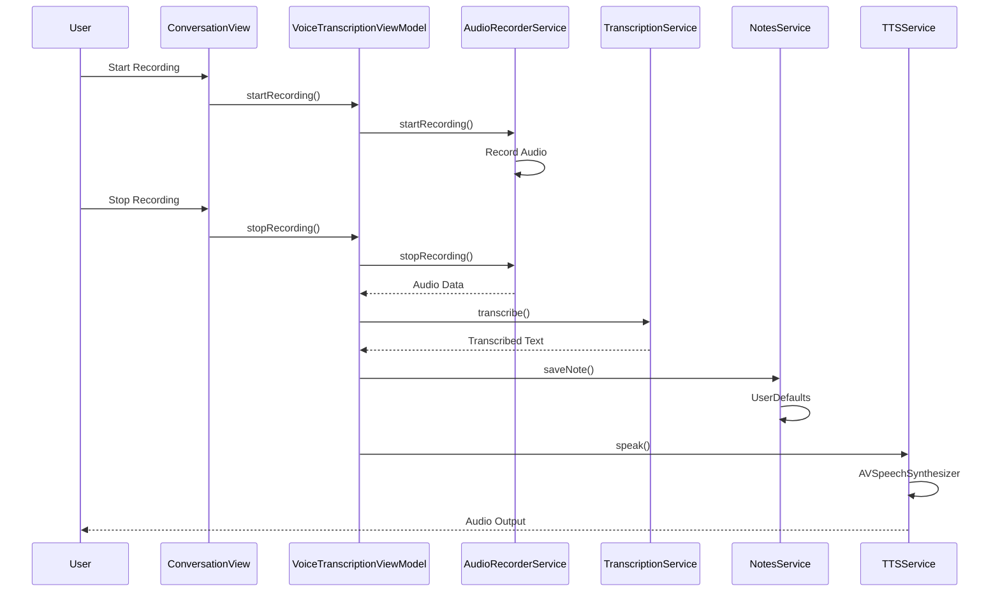
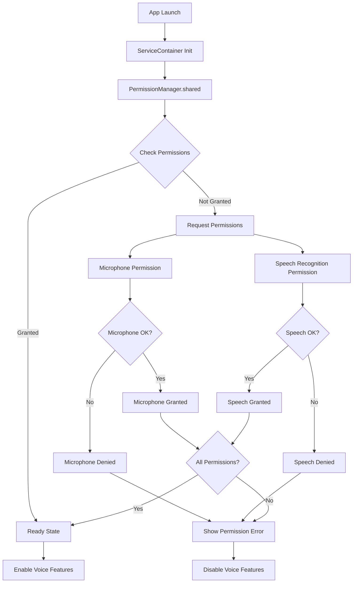
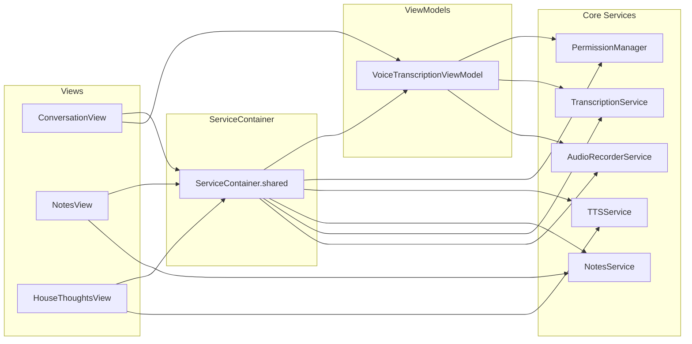
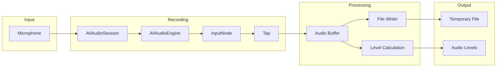
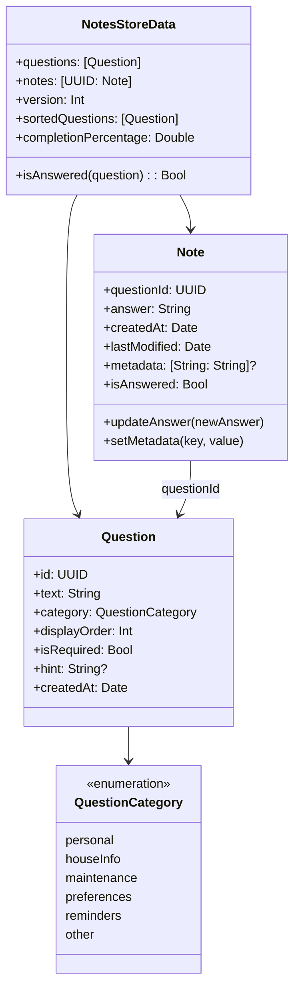
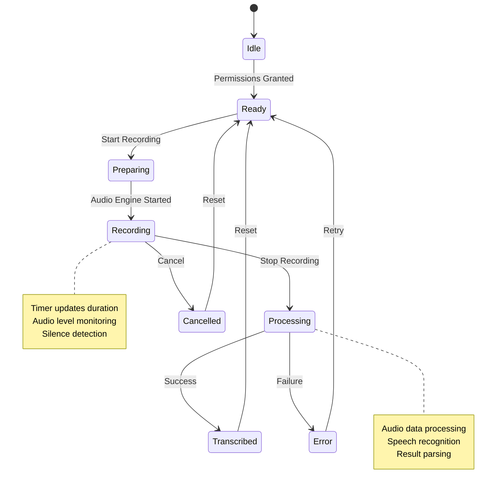
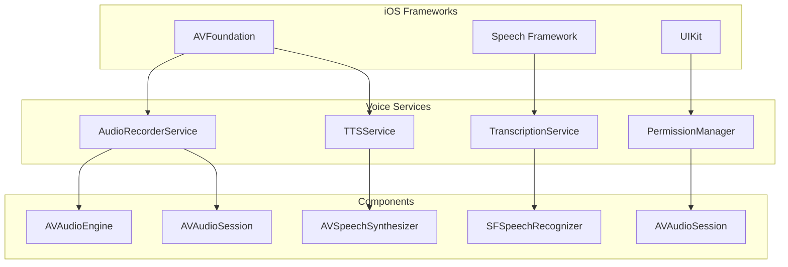
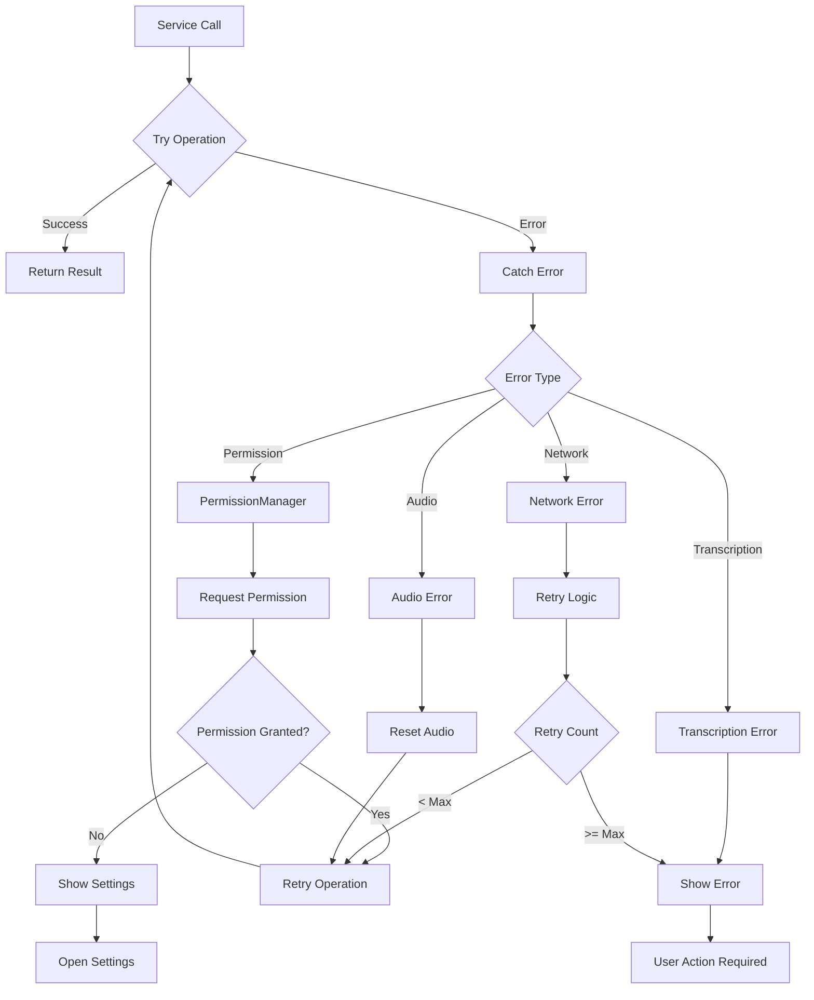
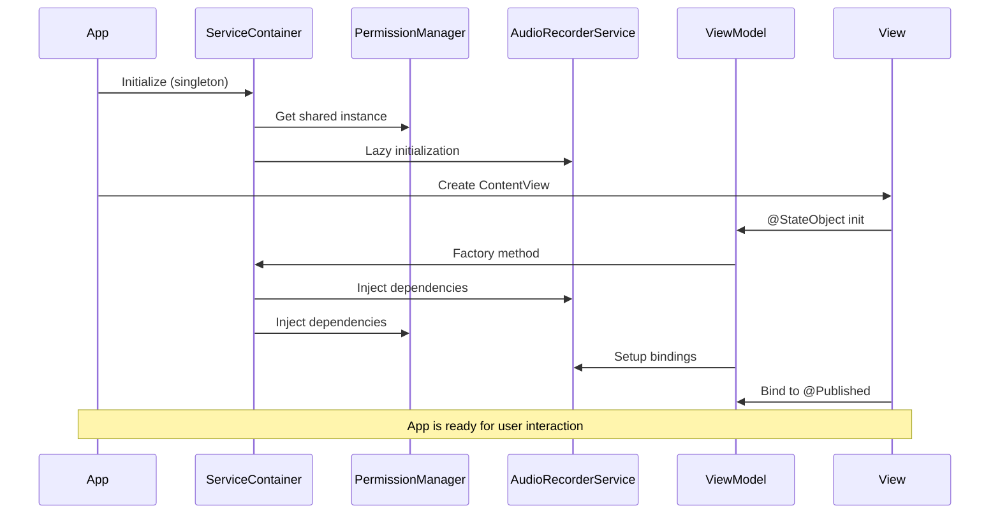
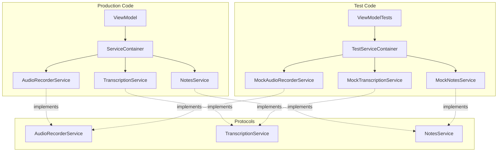

# C11S House iOS App - System Diagrams

## Service Architecture Overview

```mermaid
graph TB
    subgraph "App Layer"
        A[C11SHouseApp] --> B[ContentView]
        A --> SC[ServiceContainer]
    end
    
    subgraph "View Layer"
        B --> CV[ConversationView]
        B --> NV[NotesView]
        CV --> HTV[HouseThoughtsView]
        CV --> TV[TranscriptionView]
        CV --> VRB[VoiceRecordingButton]
    end
    
    subgraph "ViewModel Layer"
        CV --> VTM[VoiceTranscriptionViewModel]
        VTM --> SC
    end
    
    subgraph "Service Layer"
        SC --> AS[AudioRecorderService]
        SC --> TS[TranscriptionService]
        SC --> NS[NotesService]
        SC --> TTS[TTSService]
        SC --> PM[PermissionManager]
    end
    
    subgraph "Infrastructure Layer"
        AS --> ASM[AudioSessionManager]
        AS --> AE[AudioEngine]
        TS --> CR[ConversationRecognizer]
        PM --> iOS[iOS Frameworks]
    end
    
    subgraph "Data Layer"
        NS --> UD[UserDefaults]
        AS --> TF[Temporary Files]
        CV --> @S[App Storage]
    end
```

## Data Flow Architecture



## Permission Management Flow



## Service Dependencies



## Audio Processing Pipeline



## Notes Data Model



## State Management



## Voice Service Integration



## Error Handling Flow



## Component Lifecycle



## Testing Architecture



These diagrams provide a comprehensive view of the actual implemented architecture, showing the real relationships between components, data flow, and system interactions in the C11S House iOS app.