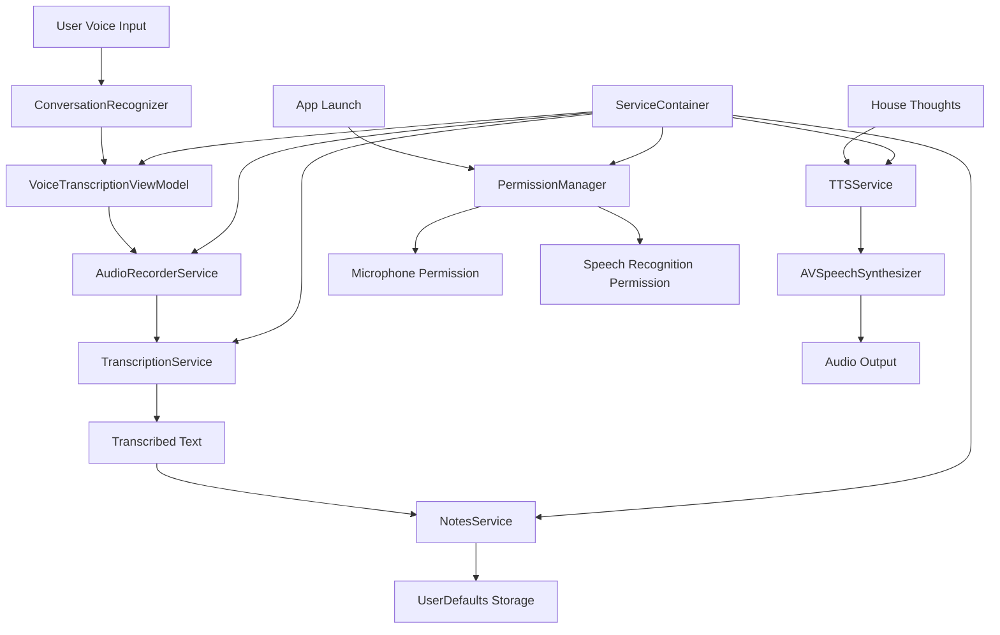

# iOS House Consciousness App Architecture

## Overview

The c11s-house-ios app provides a voice-based interface to interact with a house consciousness system. The architecture follows a **ServiceContainer + MVVM pattern** with SwiftUI, prioritizing simplicity, testability, and maintainability while providing a clean separation of concerns.

## Architecture Pattern: ServiceContainer + MVVM

### Core Principles
- **Service Container Pattern**: Centralized dependency injection via singleton ServiceContainer
- **Protocol-Oriented Design**: Heavy use of protocols for service abstraction
- **Reactive Programming**: Combine framework for data flow and state management
- **SwiftUI MVVM**: ViewModels as ObservableObjects with @Published properties
- **Testability**: Protocol-based services enable easy mocking and testing

## Actual Module Structure

```
C11SHouse/
├── C11SHouseApp.swift              # Main app entry point
├── ContentView.swift               # Main landing screen
├── Models/
│   ├── HouseThought.swift          # House consciousness thoughts/emotions
│   ├── NotesStore.swift            # Q&A notes data models
│   └── TranscriptionState.swift    # Voice transcription state
├── Services/
│   ├── ServiceContainer.swift      # Dependency injection container
│   ├── NotesService.swift          # Notes/Q&A management service
│   ├── AudioRecorderServiceImpl.swift # Audio recording implementation
│   ├── TranscriptionServiceImpl.swift # Speech-to-text implementation
│   └── TTSServiceImpl.swift        # Text-to-speech implementation
├── ViewModels/
│   └── VoiceTranscriptionViewModel.swift # Voice interaction state
├── Views/
│   ├── ConversationView.swift      # Main voice conversation interface
│   ├── NotesView.swift            # Q&A notes management
│   ├── HouseThoughtsView.swift    # House consciousness display
│   ├── TranscriptionView.swift    # Voice transcription UI
│   ├── PermissionRequestView.swift # Permission request UI
│   └── VoiceRecordingButton.swift  # Voice recording controls
├── Infrastructure/
│   └── Voice/
│       ├── AudioEngine.swift       # Audio processing engine
│       ├── AudioSessionManager.swift # Audio session management
│       ├── ConversationRecognizer.swift # Speech recognition
│       ├── PermissionManager.swift  # Centralized permission handling
│       ├── VoiceRecorder.swift     # Voice recording utilities
│       └── VoiceRecorderExampleView.swift # Example implementation
└── Tests/
    ├── C11SHouseTests/
    ├── C11SHouseUITests/
    └── ThreadingSafetyTests/
```

## Data Flow Diagram



## Core Components

### 1. ServiceContainer
**Responsibilities:**
- Centralized dependency injection
- Service lifecycle management
- Configuration management
- Factory methods for ViewModels

**Key Features:**
- Singleton pattern for app-wide access
- Protocol-based service registration
- Lazy initialization for performance
- Environment injection for SwiftUI

**Implementation:**
```swift
class ServiceContainer: ObservableObject {
    static let shared = ServiceContainer()
    
    private(set) lazy var audioRecorder: AudioRecorderService = {
        AudioRecorderServiceImpl()
    }()
    
    private(set) lazy var transcriptionService: TranscriptionService = {
        TranscriptionServiceImpl()
    }()
    
    private(set) lazy var notesService: NotesService = {
        NotesServiceImpl()
    }()
    
    private(set) lazy var ttsService: TTSService = {
        TTSServiceImpl()
    }()
    
    private(set) lazy var permissionManager = PermissionManager.shared
}
```

### 2. Voice Services Layer
**Responsibilities:**
- Audio recording and processing
- Speech-to-text transcription
- Text-to-speech synthesis
- Permission management

**Key Services:**
- `AudioRecorderServiceImpl`: AVAudioEngine-based audio recording
- `TranscriptionServiceImpl`: Apple Speech framework integration
- `TTSServiceImpl`: AVSpeechSynthesizer for text-to-speech
- `PermissionManager`: Centralized permission handling

### 3. Data Layer
**Responsibilities:**
- Local data persistence
- Data model definitions
- State management

**Key Components:**
- `NotesStore`: Q&A notes data model with UserDefaults persistence
- `HouseThought`: House consciousness thoughts and emotions
- `TranscriptionState`: Voice transcription state machine

### 4. Presentation Layer
**Responsibilities:**
- SwiftUI views and navigation
- State management via ViewModels
- User interaction handling

**Key Components:**
- `VoiceTranscriptionViewModel`: Manages voice interaction state
- `ConversationView`: Main voice conversation interface
- `NotesView`: Q&A notes management interface

## Service Protocols

### 1. Audio Recording Service
```swift
protocol AudioRecorderService {
    var audioLevelPublisher: AnyPublisher<AudioLevel, Never> { get }
    var isRecordingPublisher: AnyPublisher<Bool, Never> { get }
    
    func startRecording(configuration: TranscriptionConfiguration) async throws
    func stopRecording() async throws -> Data
    func cancelRecording()
    func updateAudioLevel()
}
```

### 2. Transcription Service
```swift
protocol TranscriptionService {
    func transcribe(audioData: Data, configuration: TranscriptionConfiguration) async throws -> TranscriptionResult
}
```

### 3. Notes Service
```swift
protocol NotesService {
    var notesStorePublisher: AnyPublisher<NotesStoreData, Never> { get }
    
    func loadNotesStore() async throws -> NotesStoreData
    func saveNote(_ note: Note) async throws
    func updateNote(_ note: Note) async throws
    func deleteNote(for questionId: UUID) async throws
    func addQuestion(_ question: Question) async throws
    func deleteQuestion(_ questionId: UUID) async throws
    func resetToDefaults() async throws
    func clearAllData() async throws
}
```

### 4. TTS Service
```swift
protocol TTSService: AnyObject {
    var isSpeaking: Bool { get }
    var isSpeakingPublisher: AnyPublisher<Bool, Never> { get }
    var speechProgressPublisher: AnyPublisher<Float, Never> { get }
    
    func speak(_ text: String, language: String?) async throws
    func stopSpeaking()
    func pauseSpeaking()
    func continueSpeaking()
    func setRate(_ rate: Float)
    func setPitch(_ pitch: Float)
    func setVolume(_ volume: Float)
}
```

## State Management

### 1. SwiftUI + Combine Pattern
- `@StateObject` for ViewModel lifecycle
- `@Published` properties for reactive updates
- `@EnvironmentObject` for dependency injection
- `CurrentValueSubject` for service-level state

### 2. Permission State
```swift
@MainActor
class PermissionManager: ObservableObject {
    @Published private(set) var microphonePermissionStatus: AVAudioSession.RecordPermission = .undetermined
    @Published private(set) var speechRecognitionPermissionStatus: SFSpeechRecognizerAuthorizationStatus = .notDetermined
    @Published private(set) var allPermissionsGranted: Bool = false
    @Published private(set) var permissionError: String?
}
```

### 3. Transcription State Machine
```swift
enum TranscriptionState {
    case idle
    case ready
    case preparing
    case recording(duration: TimeInterval)
    case processing
    case transcribed(text: String)
    case error(TranscriptionError)
    case cancelled
}
```

## Data Persistence

### 1. UserDefaults Storage
- Notes and Q&A data stored as JSON in UserDefaults
- Suitable for small structured data
- Automatic encoding/decoding with Codable

### 2. Temporary File Storage
- Audio recordings stored temporarily in Documents directory
- Automatic cleanup after processing
- WAV format for high-quality audio

## Integration with iOS Frameworks

### 1. AVFoundation
- `AVAudioEngine` for audio recording
- `AVSpeechSynthesizer` for text-to-speech
- `AVAudioSession` for audio session management

### 2. Speech Framework
- `SFSpeechRecognizer` for speech-to-text
- Both server-based and on-device recognition
- Automatic language detection

### 3. SwiftUI
- Declarative UI with reactive state updates
- Navigation via `NavigationView` and `NavigationLink`
- Environment-based dependency injection

## Testing Architecture

### 1. Protocol-Based Design
- All services use protocols for easy mocking
- Dependency injection enables test isolation
- Clear separation of concerns

### 2. Test Types
- Unit tests for services and ViewModels
- UI tests for user interactions
- Threading safety tests for concurrent operations

### 3. Mock Services
```swift
class MockNotesService: NotesService {
    var mockNotesStore = NotesStoreData()
    
    func loadNotesStore() async throws -> NotesStoreData {
        return mockNotesStore
    }
    
    // Other mock implementations...
}
```

## Performance Considerations

### 1. Audio Processing
- Real-time audio level monitoring at 20Hz
- Streaming audio processing with 1024-frame buffers
- Efficient RMS and peak level calculations

### 2. Memory Management
- Lazy service initialization
- Automatic cleanup of temporary files
- Weak references to prevent retain cycles

### 3. Threading
- `@MainActor` for UI updates
- Background processing for audio operations
- Proper async/await usage throughout

## Security and Privacy

### 1. Permission Handling
- Explicit user consent for microphone access
- Speech recognition permission handling
- Graceful degradation when permissions denied

### 2. Data Privacy
- Local storage of sensitive data
- Temporary file cleanup
- No network transmission of audio data

## Scalability and Extensibility

### 1. Service Container Pattern
- Easy addition of new services
- Configuration-based service switching
- Factory methods for complex object creation

### 2. Protocol-Oriented Design
- Multiple implementations possible (e.g., on-device vs server transcription)
- Easy service replacement without code changes
- Clear contracts between components

## Key Differences from Original Plan

### What Was Actually Built vs. Planned

**Implemented:**
- Simple ServiceContainer dependency injection (not Clean Architecture)
- SwiftUI MVVM pattern (not MVVM-C with Coordinators)
- UserDefaults persistence (not CoreData)
- Direct iOS framework integration (not abstracted repositories)
- Single-module structure (not multi-layer architecture)

**Benefits of Actual Implementation:**
- Simpler and more maintainable
- Faster development cycle
- Better suited for small to medium-sized apps
- More aligned with SwiftUI patterns
- Easier testing and debugging

**Trade-offs:**
- Less abstraction layers
- More direct framework dependencies
- Simpler but potentially less scalable for very large apps
- More pragmatic approach over theoretical purity

This architecture successfully delivers the core functionality while maintaining clean code principles and testability, proving that sometimes a simpler approach is more effective than complex architectural patterns.